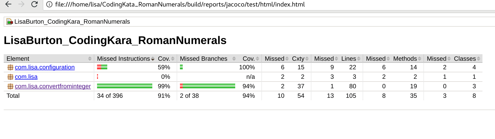
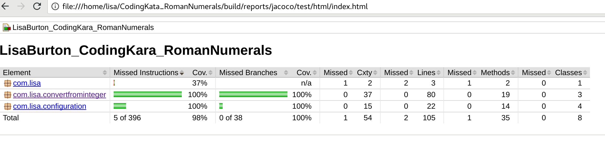

# Coding Kata: Decimals to Roman Numerals  

Author: Lisa Burton  

## Technical questions

- [Question 1](./docs/question_one.md)
- [Question 2](./docs/question_two.md)
- [Question 3](./docs/question_three.md)
- [Question 4](./docs/question_four.md)

## Technical overview

This solution is written in Java and makes use of the following technologies:

- Spring Boot for the Inversion-of-Control container, profile management 
system, integration test framework and internationalisation support. 

- The Gradle build system to compile, test and package the code.

- JUnit to run the unit and integration tests.

- Mockito for invocation verification in the unit tests.
  
When I started this project, I found it difficult to decide whether I should implement a solution using only core Java, or whether I should use Spring. I worried that it might be seen as overkill for such a Kata task, but I wanted to demonstrate how I approach real projects for production environments.  
  
## Approach

After reading the Kata specification, I thought of a rough algorithm. I tested it on paper and looked for ways to refine it. The core algorithm is essentially (loose pseudo code):  
  
```java
while inputInteger is not 0
  for integerIndex in decimalToNumeralLookupTable) {
    numeralCountToAppend = inputInteger / integerIndex
    for i in 0 to numeralCountToAppend
      numeralString = numeralString + decimalToNumeralLookupTable.get(integerIndex)
    }
    inputInteger = inputInteger % integerIndex
  }
}
```
  
The decimalToNumeralLookupTable in the above pseudo code defines a sorted map of integer numeral pairs the algorithm can use for conversions. The main limitation is that the map needs to define a numeral for 1, otherwise the program won't always be able to generate accurate representations of all input numbers. The algorithm has no concept of subtractive notation, so the lookup table must define those as distinct numerals. Below is an example lookup table with subtractive notation numerals defined as entries:  
  
```yml
numeral-representation:
  numeral-table:
    decimal-to-numeral-map:
      1: 'I'
      4: 'IV'
      5: 'V'
      9: 'IX'
      10: 'X'
      40: 'XL'
      50: 'L'
      90: 'XC'
      100: 'C'
      400: 'CD'
      500: 'D'
      900: 'CM'
      1000: 'M'
```
  
My code defines the above lookup table in `src/main/resources/application.yml` as part of the profile `bbc-kata-specification` (the default profile). Storing the lookup table in the application configuration file makes it possible to support for alternative notations with little or no code changes.  
  
The acceptable input range is any integer between 1 and 3999 (inclusive). This range can be changed in the `application.yml`:
  
  ```yml
  input-limits:
  from-integer:
    minimum-input-integer: 1
    maximum-input-integer: 3999
  ```
  
I've designed the application so that it can be reconfigured to handle alternative Numeral notations and accept any integer range between 0 and 2147483647 (the maximum size of an integer in Java).  
  
## Assumptions & caveats

- Negative numbers aren't a concern.
- Logging isn't a factor for the Kata.  
- It only has to work number systems with the same basic structure as Roman Numerals.  
- Real numbers aren't a concern.  
- The application cannot be configured to handle numbers above 2147483647 (inclusive)
- The validation message contains the input range meaning it must be updated to match the configured input range. ApplicationMessageConfiguration would need to be modified to accept parameters or the message.properties file would need to be set for each profile.  
  
## Compiling the code  

### Prerequisites  

To build the code, you need the following dependencies on your system:  

- Java Development Kit (JDK), at least version 8  
- Gradle

The code can be built using Gradle with the following commands:  

```bash
> cd CodingKata_romanNumerals/
> gradle build
```

## Unit and integration testing

The Unit Tests are stored under `src/test` and all end with `\*Test.java`.  
  
Unit tests are executed as part of the standard Gradle build tasks (see **Compiling the code**).  
Integration tests can be executed by adding `-Pintegration-tests=true` to gradle, for example:

```bash
> gradle build -Pintegration-tests=true  
```

Coverage reports show that the unit tests have around **90%** test coverage and the integration tests bring this to **98%**.  
  
Coverage report for unit tests only:  
  
  
Coverage report for integration tests only:  
  
  
The coverage report for just the unit tests can be generated by running:  

```bash
> gradle build jacocoTestReport
```

Integration and unit test coverage can be merged by running:

```bash
> gradle build jacocoTestReport -Pintegration-tests=true
```

## Running the program

The executable should be ran with a list of at least 1 integer between 1 and 3999 (inclusive)
  
Example:

```bash
> java -jar ./build/libs/LisaBurton_CodingKata_RomanNumerals-0.0.1.jar 42 43 44 45
XLII XLIII XLIV XLV
```
